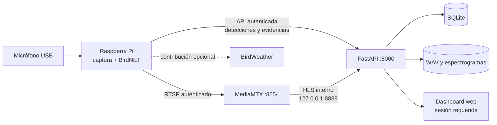
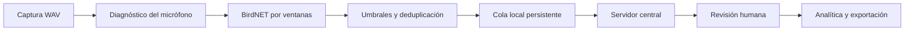

# BirdMonitor

**Monitorización bioacústica de aves con Raspberry Pi, BirdNET y un dashboard web seguro.**

BirdMonitor es un sistema distribuido de análisis acústico pasivo (PAM) desarrollado como Trabajo de Fin de Grado. Un nodo *edge* basado en Raspberry Pi captura el entorno, ejecuta BirdNET localmente y conserva una cola cuando no hay red. Un servidor central recibe las observaciones, organiza las evidencias por ubicación y ofrece revisión humana, analítica, exportación y escucha en directo desde el navegador.

> BirdMonitor ayuda a detectar y revisar actividad acústica; no sustituye un censo ornitológico ni convierte la confianza de BirdNET en certeza biológica.

## Qué ofrece

| Área | Funcionalidad |
|---|---|
| Captura | Ciclos configurables; por defecto, 60 s de grabación cada 300 s para limitar la carga de la Raspberry Pi |
| Clasificación | BirdNET local, ventanas solapadas, umbrales por tipo de sonido y conservación de varias especies por grabación |
| Evidencia | WAV original, espectrograma realzado e intervalo exacto clasificado por BirdNET |
| Calidad | RMS, clipping, desplazamiento DC, exceso de graves, zumbido de red y contraste del evento |
| Revisión | Validación, rechazo o corrección manual con trazabilidad; sugerencias de aprendizaje asistido |
| Analítica | Actividad temporal, riqueza, diversidad, distribución de especies y métricas acústicas |
| Exportación | CSV interoperable e informe XLSX con hojas, estilos, filtros y gráficos |
| Ubicaciones | Historial independiente por sitio y despliegue, incluso cuando una Raspberry se traslada |
| Directo | Publicación RTSP autenticada y reproducción HLS protegida dentro del dashboard |
| Seguridad | Sesiones, CSRF, token exclusivo del nodo, medios privados y perfiles de red local/Tailscale |

El cliente oficial es el **dashboard web responsive**. Funciona en ordenador, tableta y móvil sin instalar una aplicación. El prototipo Flutter se conserva únicamente como [componente legado](mobile/birdmonitor_app/README.md).

## Arquitectura



La Raspberry publica una única señal de audio. MediaMTX la redistribuye, por lo que abrir varios navegadores no multiplica la captura, el análisis de BirdNET ni el proceso FFmpeg del nodo.

### Flujo de una observación



1. El nodo graba un WAV y calcula métricas sin modificar la señal original.
2. BirdNET analiza ventanas de audio y devuelve las clases candidatas.
3. Se aplican umbrales configurables. Se conservan distintas especies detectadas en la grabación y, para cada especie, la observación de mayor confianza.
4. La detección, sus coordenadas y el identificador del despliegue se guardan en una cola SQLite del nodo.
5. Cuando el servidor está disponible, se sincronizan datos, audio y espectrograma. Un traslado posterior no cambia la procedencia de observaciones antiguas.
6. La revisión humana puede confirmar, rechazar o corregir el resultado de la IA.

## Componentes

| Ruta | Responsabilidad | Tecnologías principales |
|---|---|---|
| `hardware/raspberry_pi/` | Captura, BirdNET, métricas, cola *offline*, BirdWeather y control remoto de ubicación | Python, birdnetlib, ALSA, FFmpeg |
| `backend/app/` | API, autenticación, persistencia, ubicaciones, medios, streaming y exportaciones | FastAPI, SQLAlchemy, Pydantic, SQLite |
| `backend/analisisBiodiversidad.py` | Índices bioacústicos y ecológicos | NumPy, SciPy, scikit-maad |
| `frontend/` | Dashboard responsive y reproductores de evidencia/directo | HTML, CSS, JavaScript, Chart.js, Leaflet |
| `tools/mediamtx/` | Configuración endurecida del servidor multimedia | MediaMTX |
| `scripts/` | Configuración, instalación, diagnóstico y reparación | Python, PowerShell, Bash |
| `tests/` | Pruebas de análisis, API, seguridad, ubicación, sincronización y streaming | pytest |

## Sitios, despliegues y nodos

BirdMonitor no crea una base de datos distinta por ciudad. Mantiene una base central y separa cada registro mediante relaciones explícitas:

| Concepto | Ejemplo | Para qué sirve |
|---|---|---|
| **Sitio** | Sevilla, Algeciras o Sangüesa | Lugar estable que se puede consultar en el histórico |
| **Despliegue** | Una campaña de agosto en Algeciras | Periodo durante el que un nodo estuvo físicamente en un sitio |
| **Nodo** | `birdmonitor-01` | Identidad estable de la Raspberry Pi |
| **Detección** | Un mirlo a una hora concreta | Conserva su sitio y despliegue de origen para siempre |

El selector superior del dashboard **consulta datos históricos**; no mueve físicamente el nodo. El cambio de ubicación activa se confirma tras iniciar sesión y se envía como una orden auditada. La Raspberry la aplica entre ciclos, actualiza las coordenadas de BirdNET/BirdWeather y responde al servidor. Si está desconectada, la orden queda pendiente y las capturas mantienen el último contexto confirmado.

## Requisitos

### Servidor central

- Windows 10/11 o macOS con Python 3 y `venv`.
- [MediaMTX](https://github.com/bluenviron/mediamtx/releases) para la escucha en directo.
- Una IP privada estable: LAN para modo local o IP de Tailscale para acceso entre redes.
- PowerShell como administrador en Windows para registrar tareas y reglas de Firewall.

### Nodo edge

- Raspberry Pi con Raspberry Pi OS, Python, FFmpeg y ALSA.
- Entorno compatible con `birdnetlib==0.18.1` y el modelo BirdNET.
- Micrófono reconocido por ALSA.
- Servicios `birdmonitor.service` y `birdstream.service` configurados mediante `systemd`.
- Tailscale instalado en el nodo cuando se use ese perfil.

## Instalación rápida del servidor en Windows

La guía completa está en [docs/INSTALACION.md](docs/INSTALACION.md). Hay recorridos separados para [red local](docs/INSTALACION_LOCAL.md) y [Tailscale](docs/INSTALACION_TAILSCALE.md).

### 1. Preparar el proyecto

```powershell
git clone https://github.com/guti-48/TFG-monitoreo-aves.git
Set-Location .\TFG-monitoreo-aves\monitoreo_aves

python -m venv venv
.\venv\Scripts\python.exe -m pip install --upgrade pip
.\venv\Scripts\python.exe -m pip install -r requirements.txt
```

Si tu clon deja `backend/` directamente en la raíz, no entres en `monitoreo_aves`: ejecuta los comandos desde la carpeta que contiene `requirements.txt`.

Descarga el binario de MediaMTX y colócalo en:

```text
tools/mediamtx/mediamtx.exe
```

La configuración `tools/mediamtx/mediamtx.secure.yml` sí está versionada; el binario y las credenciales no deben subirse a Git.

### 2. Crear identidades y elegir la red

```powershell
# Crea el administrador, el secreto de sesión y el token del nodo.
.\venv\Scripts\python.exe scripts\configure_security.py

# Opción A: todos los equipos en una LAN privada.
.\venv\Scripts\python.exe scripts\configure_network_mode.py `
  --mode local `
  --server-host IP_LAN_DEL_SERVIDOR

# Opción B: Raspberry y usuarios en redes diferentes.
.\venv\Scripts\python.exe scripts\configure_network_mode.py `
  --mode tailscale `
  --server-host IP_TAILSCALE_DEL_SERVIDOR

# Genera credenciales independientes para RTSP/HLS.
.\venv\Scripts\python.exe scripts\configure_stream_security.py
```

Los dos asistentes sensibles muestran una credencial una sola vez. El token del nodo se copia a `/etc/birdmonitor/birdmonitor.env`; la contraseña de publicación se introduce después con el configurador de streaming de la Raspberry.

### 3. Instalar el arranque automático

Abre PowerShell **como administrador** en la raíz del proyecto:

```powershell
.\scripts\windows\install_birdmonitor_windows.ps1
.\scripts\windows\check_birdmonitor_windows.ps1
```

El instalador registra `BirdMonitor Backend` y `BirdMonitor MediaMTX` como tareas ocultas al iniciar sesión, aplica el perfil de red y verifica los puertos. La base de datos y los medios no se eliminan al reinstalar las tareas.

### 4. Abrir el dashboard

```text
En el servidor:        http://127.0.0.1:8000
Desde otro dispositivo: http://IP_PRIVADA_DEL_SERVIDOR:8000
```

El primer acceso redirige a `/login`. No abras los puertos de BirdMonitor en el router.

## Instalación rápida del servidor en macOS

Clona el repositorio fuera de `Desktop`, `Documents` y `Downloads`, ya que los permisos de privacidad de macOS pueden impedir que un `LaunchAgent` lea esas carpetas:

```bash
mkdir -p ~/Projects
cd ~/Projects
git clone https://github.com/guti-48/TFG-monitoreo-aves.git
cd TFG-monitoreo-aves/monitoreo_aves

python3 -m venv venv
./venv/bin/python -m pip install --upgrade pip
./venv/bin/python -m pip install -r requirements.txt
```

Coloca el binario de MediaMTX para Darwin en `tools/mediamtx/macos/mediamtx` y dale permiso de ejecución. Después ejecuta los mismos asistentes de seguridad/red con `./venv/bin/python` e instala el arranque automático:

```bash
chmod +x tools/mediamtx/macos/mediamtx
./scripts/macos/install_birdmonitor_macos.sh
./scripts/macos/check_birdmonitor_macos.sh
```

La automatización utiliza `~/Library/LaunchAgents/com.birdmonitor.services.plist`. En macOS se debe revisar además el Firewall del sistema, porque el instalador no crea sus reglas automáticamente.

## Instalación del nodo Raspberry Pi

La guía operativa específica está en [hardware/raspberry_pi/README.md](hardware/raspberry_pi/README.md). En resumen:

1. Instala el repositorio y el entorno BirdNET en la Raspberry.
2. Copia `hardware/raspberry_pi/birdmonitor.env.example` a `/etc/birdmonitor/birdmonitor.env`, establece permisos `600` y completa servidor, token, nodo, sitio, coordenadas y captura.
3. Configura el primer sitio con `configure_site.py`.
4. Introduce de forma interactiva la credencial RTSP con `configure_stream_publisher.py`.
5. Reinicia y comprueba `birdmonitor.service`, `birdstream.service` y, si procede, `tailscaled.service`.

Ejemplo del paso de streaming:

```bash
sudo python3 scripts/raspberry_pi/configure_stream_publisher.py \
  --network-mode tailscale \
  --server-host IP_TAILSCALE_DEL_SERVIDOR
```

El script no incluye la contraseña en el historial: la solicita sin mostrarla, la guarda bajo `/etc/birdmonitor/` con permisos restrictivos y restaura la unidad anterior si FFmpeg no permanece estable.

## Modos de red

| Perfil | Uso recomendado | Alcance permitido | Consideración |
|---|---|---|---|
| `local` | Todos los equipos están en la misma red privada controlada | Subred local | HTTP no cifra el tráfico frente a otros usuarios de esa LAN |
| `tailscale` | Nodo, servidor o usuarios están en redes distintas | Dispositivos autorizados de la *tailnet* | Recomendado para acceso remoto; conviene definir políticas ACL |

| Puerto | Servicio | Exposición esperada |
|---:|---|---|
| `8000` | Dashboard y API FastAPI | IP privada elegida y loopback |
| `8554` | Publicación/lectura RTSP autenticada | IP privada elegida |
| `8888` | HLS de MediaMTX | Sólo `127.0.0.1`; FastAPI lo entrega tras validar la sesión |

Cambiar de perfil no borra datos. Vuelve a ejecutar `configure_network_mode.py`, actualiza el publicador de la Raspberry y aplica el perfil:

```powershell
.\scripts\windows\apply_network_mode.ps1
```

## Configuración principal

El servidor guarda la configuración real en `backend/birdmonitor.env`. La Raspberry usa `/etc/birdmonitor/birdmonitor.env`. Ambos archivos contienen secretos, están excluidos de Git y no deben aparecer en capturas, memorias o incidencias.

| Variable del nodo | Valor habitual | Efecto |
|---|---:|---|
| `BIRDMONITOR_SERVER_URL` | `http://IP:8000` | Servidor central visto desde la Raspberry |
| `BIRDMONITOR_NODE_NAME` | `birdmonitor-01` | Identidad estable y única del hardware |
| `BIRDMONITOR_RECORD_SECONDS` | `60` | Duración de cada captura |
| `BIRDMONITOR_RECORD_INTERVAL_SECONDS` | `300` | Inicio de un ciclo respecto al anterior |
| `BIRDMONITOR_BIRD_CONFIDENCE_THRESHOLD` | `0.65` | Confianza mínima inicial para aves |
| `BIRDMONITOR_BIRDNET_OVERLAP_SECONDS` | `1.5` | Solapamiento de ventanas BirdNET |
| `BIRDMONITOR_BIRDNET_SENSITIVITY` | `1.25` | Sensibilidad del analizador |
| `BIRDMONITOR_RETENTION_DAYS` | `9` | Retención local de WAV y espectrogramas ya gestionados |
| `BIRDWEATHER_ENABLED` | `0` | Activa la contribución opcional a BirdWeather |

Los umbrales no deben ajustarse usando una sola grabación. Conviene reunir muestras de varios periodos, revisar falsos positivos/negativos y documentar cualquier cambio para mantener la comparabilidad.

### Ajuste del micrófono

La espuma o el pelo antiviento reducen turbulencias, pero no eliminan zumbido eléctrico, ruido propio del preamplificador, vibración de la caja o una ganancia inadecuada. BirdMonitor diagnostica esos problemas y permite fijar el nivel ALSA mediante:

- `BIRDMONITOR_MIC_ALSA_CARD`
- `BIRDMONITOR_MIC_CAPTURE_VOLUME`
- `BIRDMONITOR_MIC_AUTO_GAIN`

El reproductor utiliza el **WAV original** y limita la escucha al tramo de revisión. El espectrograma sí aplica un paso alto y normalización frente al fondo para facilitar la inspección visual, pero no sobrescribe la evidencia ni cambia el audio que analizó BirdNET. Un filtro puede mejorar la representación, pero no recuperar una señal saturada o un canto que nunca superó el ruido del hardware.

## Uso del dashboard

Tras iniciar sesión se puede:

- consultar detecciones por sitio, despliegue, fechas, especie y confianza;
- escuchar el WAV y localizar la ventana clasificada sobre el espectrograma;
- escuchar el audio original y revisar avisos de calidad;
- confirmar, rechazar o corregir una especie;
- consultar actividad, biodiversidad y distribución completa de especies;
- descargar CSV o un informe Excel estructurado;
- escuchar el directo y detenerlo para un dispositivo o para todos;
- consultar campañas históricas sin que la Raspberry siga instalada allí;
- confirmar una nueva ubicación física del nodo sin entrar por SSH.

El cambio de ubicación activa requiere sesión y protección CSRF. Se procesa entre capturas para no interrumpir un WAV en curso.

## Operación y diagnóstico

### Servidor Windows

```powershell
# Estado integral de tareas, red, seguridad y puertos.
.\scripts\windows\check_birdmonitor_windows.ps1

# Reparar una tarea Backend atascada o en estado Queued.
.\scripts\windows\repair_backend_task.ps1

# Reconstruir sólo la tarea de escucha sin reiniciar el backend.
.\scripts\windows\apply_stream_security.ps1 -SkipBackendReload

# Recargar backend y streaming tras cambios.
.\scripts\windows\restart_birdmonitor_streaming.ps1

# Comprobación mínima.
curl.exe http://127.0.0.1:8000/health
```

Los registros de ejecución se guardan en `%LOCALAPPDATA%\BirdMonitor`.

### Raspberry Pi

```bash
sudo systemctl status birdmonitor.service birdstream.service --no-pager
sudo journalctl -u birdmonitor.service -n 100 --no-pager
sudo journalctl -u birdstream.service -n 100 --no-pager
```

| Síntoma | Comprobación recomendada |
|---|---|
| La tarea del backend queda `Queued` | Ejecutar `repair_backend_task.ps1` como administrador y revisar `backend.log` |
| `/health` no responde | Comprobar la tarea, el puerto 8000 y `%LOCALAPPDATA%\BirdMonitor\backend.log` |
| El directo figura activo pero no se oye | Revisar `birdstream.service`, la entrada ALSA y el log de MediaMTX |
| MediaMTX devuelve `401` | Repetir la configuración del publicador con la credencial vigente; no pegarla en la unidad `systemd` |
| El dashboard muestra datos de otro lugar | Cambiar el filtro histórico o confirmar la ubicación física; son operaciones distintas |
| La interfaz parece antigua tras actualizar | Forzar recarga con `Ctrl+F5` y comprobar que sólo haya un backend escuchando |

## Seguridad

La instalación segura es parte del funcionamiento, no un complemento opcional:

- contraseña administradora almacenada como hash;
- sesiones firmadas con cookies `HttpOnly` y `SameSite=Strict`;
- CSRF en operaciones que cambian estado;
- token del nodo almacenado como hash y limitado a sus rutas;
- validación de nombres, rutas de archivos, parámetros y fórmulas de Excel;
- audios, espectrogramas, exportaciones y HLS detrás de autenticación;
- credenciales separadas para publicar, leer y servir el stream;
- HLS enlazado únicamente a loopback;
- Firewall y middleware restringidos al perfil local o Tailscale;
- secretos y binarios excluidos del repositorio.

No se debe publicar `8000`, `8554` ni `8888` mediante reenvío de puertos, DMZ o una IP pública. Consulta la política, las limitaciones y la respuesta ante incidentes en [SECURITY.md](SECURITY.md). La implementación realizada se resume en [docs/INFORME_SEGURIDAD.md](docs/INFORME_SEGURIDAD.md).

## Pruebas

Desde la raíz del proyecto:

```powershell
.\venv\Scripts\python.exe -m pytest -q
node --check frontend\js\dashboard.js
```

Las pruebas cubren análisis acústico, calidad del audio, API, exportación, autenticación, CSRF, streaming, aislamiento de red, sincronización *offline* y migración/cambio remoto de ubicaciones.

## Estructura del repositorio

```text
monitoreo_aves/
├── backend/
│   ├── app/
│   │   ├── core/              # Configuración, base de datos y seguridad
│   │   ├── domain/            # Modelos y esquemas
│   │   └── features/          # Funcionalidades agrupadas por dominio
│   └── analisisBiodiversidad.py
├── frontend/                  # Dashboard web responsive
├── hardware/raspberry_pi/     # Nodo edge, BirdNET y cola offline
├── scripts/
│   ├── windows/               # Instalación y operación del servidor
│   ├── macos/                 # LaunchAgent y comprobaciones
│   └── raspberry_pi/          # Endurecimiento del publicador RTSP
├── tools/mediamtx/            # Configuración segura; binario no versionado
├── tests/                     # Suite automatizada
├── docs/                      # Instalación e informe técnico de seguridad
├── SECURITY.md
└── requirements.txt
```

## Alcance y limitaciones

- BirdNET puede producir falsos positivos y falsos negativos, especialmente con cantos lejanos, especies solapadas o ruido dominante.
- Las coordenadas y la fecha mejoran el contexto del modelo, pero pueden penalizar especies introducidas o inusuales; la revisión humana conserva el resultado corregido sin reentrenar el modelo base.
- El sistema guarda varias especies encontradas en una captura, aunque la separación perfecta de voces simultáneas depende del modelo y de la relación señal/ruido.
- SQLite es apropiado para una instalación privada con un servidor central; un servicio multiusuario público requeriría otra arquitectura de despliegue y endurecimiento adicional.
- El directo está diseñado para supervisión y presenta varios segundos de latencia por HLS.
- La calidad final depende del micrófono, su ganancia, alimentación, montaje, protección ambiental y distancia a la fuente.

## Tecnologías y referencias

- [BirdNET](https://birdnet.cornell.edu/) — clasificación acústica de aves.
- [birdnetlib](https://github.com/joeweiss/birdnetlib) — integración local de BirdNET en Python.
- [FastAPI](https://fastapi.tiangolo.com/) — API y servidor web.
- [MediaMTX](https://mediamtx.org/) — distribución RTSP/HLS.
- [scikit-maad](https://scikit-maad.github.io/) — métricas de análisis ecoacústico.
- [Tailscale](https://tailscale.com/kb/) — conectividad privada entre ubicaciones.
- [BirdWeather](https://www.birdweather.com/) — contribución opcional a ciencia ciudadana.

---

BirdMonitor prioriza tres propiedades: **evidencia trazable**, **operación accesible desde el navegador** y **despliegue privado por defecto**.
