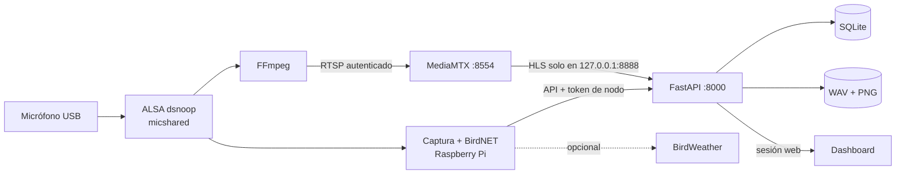

# BirdMonitor

[](https://github.com/guti-48/TFG-monitoreo-aves/actions/workflows/tests.yml)

Sistema autónomo de monitorización bioacústica que combina una Raspberry Pi,
BirdNET y un dashboard web privado. El nodo graba y analiza localmente; el
servidor conserva las evidencias, permite revisarlas y ofrece estadísticas,
exportación y escucha en directo.

> Proyecto académico de monitorización acústica pasiva (PAM). Una detección de
> BirdNET es una hipótesis que debe interpretarse junto con su confianza,
> evidencia acústica y revisión humana; no equivale por sí sola a un censo.

## Qué instala

BirdMonitor no necesita un backend en una nube pública:

| Equipo | Componentes | Responsabilidad |
|---|---|---|
| Raspberry Pi | `birdmonitor.service` | Captura WAV, métricas acústicas, BirdNET, cola sin conexión y BirdWeather opcional |
| Raspberry Pi | `birdstream.service` | Publica una única señal RTSP autenticada |
| Raspberry Pi | `birdmonitor-stream-supervisor.service` | Sincroniza el botón del dashboard y recupera el directo |
| Servidor | FastAPI + SQLite | API, autenticación, datos, evidencias, revisión y exportaciones |
| Servidor | MediaMTX | Convierte el RTSP del nodo en HLS interno |
| Navegador | Dashboard responsive | Cliente oficial para ordenador, tableta y móvil |

En Windows, el instalador registra dos tareas ocultas al iniciar sesión:
`BirdMonitor Backend` y `BirdMonitor MediaMTX`. No instala servicios de terceros
ni abre puertos en el router.

## Funcionalidades

- Grabaciones configurables; valor inicial: 60 segundos cada 5 minutos.
- Clasificación local con BirdNET y varias especies por una misma grabación.
- Coordenadas y fecha aplicadas al contexto del modelo.
- WAV original, espectrograma y ventana exacta que produjo la clasificación.
- Diagnóstico de RMS, clipping, desplazamiento DC, graves y zumbido eléctrico.
- Revisión humana: confirmar, corregir, rechazar o marcar como ruido.
- Reglas de aprendizaje local derivadas únicamente de revisiones explícitas.
- Separación histórica por nodo, sitio y despliegue.
- Índices ecoacústicos, actividad temporal, biodiversidad y mapa.
- Exportación CSV e informe Excel estructurado con filtros y gráficos.
- Escucha HLS protegida en el navegador y acceso RTSP para VLC.
- Cola SQLite en la Raspberry para conservar eventos cuando no hay red.

## Arquitectura



El análisis BirdNET y el directo son procesos independientes. Un problema del
reproductor HLS no elimina las grabaciones ni detiene la inferencia. El PCM
compartido `micshared` permite que ambos lean el mismo micrófono sin competir
por el dispositivo físico.

## Requisitos

### Servidor

- Windows 10/11 —recorrido principal— o macOS.
- Python 3.11 o posterior, Git y conexión de red privada.
- [MediaMTX](https://github.com/bluenviron/mediamtx/releases) (configuración
  verificada con la versión 1.19.2).
- PowerShell como administrador para instalar tareas y reglas de Firewall.
- Tailscale en los equipos si se utilizará acceso entre redes diferentes.

### Nodo

- Raspberry Pi con Raspberry Pi OS de 64 bits.
- Micrófono USB reconocido por ALSA.
- Python 3, FFmpeg, PortAudio y libsndfile.
- Espacio suficiente para el modelo BirdNET incluido y la retención temporal.

## Instalación completa

El orden es importante: primero se prepara el servidor y se generan las
identidades; después se configura la Raspberry.

### 1. Servidor Windows

Abre PowerShell y clona el repositorio:

```powershell
git clone https://github.com/guti-48/TFG-monitoreo-aves.git
Set-Location .\TFG-monitoreo-aves

python -m venv venv
.\venv\Scripts\python.exe -m pip install --upgrade pip
.\venv\Scripts\python.exe -m pip install -r requirements.txt
```

`requirements.txt` contiene solamente lo necesario para el servidor. No
instala TensorFlow ni los controladores de audio de la Raspberry.

Descarga MediaMTX para Windows y coloca el ejecutable en:

```text
tools/mediamtx/mediamtx.exe
```

Genera las credenciales y elige **un** modo de red:

```powershell
# Administrador, secreto de sesión y token del nodo.
.\venv\Scripts\python.exe scripts\configure_security.py

# Opción A: servidor, Raspberry y usuarios en la misma LAN.
.\venv\Scripts\python.exe scripts\configure_network_mode.py `
  --mode local `
  --server-host 192.168.1.10

# Opción B: acceso privado desde redes distintas.
.\venv\Scripts\python.exe scripts\configure_network_mode.py `
  --mode tailscale `
  --server-host 100.x.y.z

# Credenciales separadas para publicar, leer y servir HLS.
.\venv\Scripts\python.exe scripts\configure_stream_security.py
```

Guarda temporalmente los dos valores mostrados una sola vez:

1. Token de API del nodo, producido por `configure_security.py`.
2. Contraseña RTSP de publicación, producida por
   `configure_stream_security.py`.

Los necesitarás en la Raspberry. No los copies a Git, documentación o
capturas.

Abre ahora PowerShell **como administrador**, vuelve a la raíz del proyecto y
ejecuta:

```powershell
.\scripts\windows\install_birdmonitor_windows.ps1
.\scripts\windows\check_birdmonitor_windows.ps1
```

Comprueba finalmente:

```powershell
curl.exe http://127.0.0.1:8000/health
```

La respuesta debe contener `"status":"ok"`. Abre
`http://127.0.0.1:8000`; desde otro equipo usa la IP privada seleccionada.

### Servidor macOS (alternativo)

Clona el proyecto fuera de `Desktop`, `Documents` y `Downloads`, ya que un
`LaunchAgent` puede no tener permiso para leerlos. Instala `requirements.txt`,
ejecuta los tres configuradores del servidor igual que en Windows y coloca el
binario Darwin en `tools/mediamtx/macos/mediamtx`:

```bash
chmod +x tools/mediamtx/macos/mediamtx
./scripts/macos/install_birdmonitor_macos.sh
./scripts/macos/check_birdmonitor_macos.sh
```

El instalador crea `~/Library/LaunchAgents/com.birdmonitor.services.plist`.
Debe revisarse manualmente el Firewall de macOS, porque esa automatización no
crea sus reglas.

### 2. Nodo Raspberry Pi

Instala las dependencias del sistema y clona el proyecto:

```bash
sudo apt update
sudo apt install -y git ffmpeg alsa-utils libportaudio2 libsndfile1 python3-venv

cd /home/pi
git clone https://github.com/guti-48/TFG-monitoreo-aves.git birdmonitor
cd /home/pi/birdmonitor

python3 -m venv venv
./venv/bin/python -m pip install --upgrade pip
./venv/bin/python -m pip install -r requirements-node.txt
```

La instalación de TensorFlow puede variar entre modelos de Raspberry Pi y
versiones de Python. Utiliza Raspberry Pi OS de 64 bits y un Python compatible
con la versión ofrecida por `pip` para tu arquitectura.

Prepara la configuración privada:

```bash
sudo install -d -m 700 /etc/birdmonitor
sudo cp hardware/raspberry_pi/birdmonitor.env.example \
  /etc/birdmonitor/birdmonitor.env
sudo chmod 600 /etc/birdmonitor/birdmonitor.env
sudo nano /etc/birdmonitor/birdmonitor.env
```

Completa como mínimo:

```dotenv
BIRDMONITOR_NETWORK_MODE=tailscale
BIRDMONITOR_SERVER_URL=http://100.x.y.z:8000
BIRDMONITOR_NODE_API_TOKEN=TOKEN_GENERADO_EN_EL_SERVIDOR
BIRDMONITOR_NODE_NAME=birdmonitor-01
BIRDMONITOR_MIC_ALSA_CARD=3
BIRDMONITOR_MIC_CAPTURE_VOLUME=50%
BIRDMONITOR_MIC_AUTO_GAIN=0
BIRDMONITOR_MIC_DEVICE=
```

Para modo local cambia la URL por la IPv4 LAN. Si usas Tailscale, instálalo y
conecta la Raspberry a la misma *tailnet* antes de continuar.

Registra el primer sitio. Valida primero con `--dry-run`:

```bash
sudo ./venv/bin/python hardware/raspberry_pi/configure_site.py \
  --site-code mi-sitio \
  --site-name "Nombre de la ubicación" \
  --municipality "Municipio" \
  --region "Provincia" \
  --country-code ES \
  --timezone Europe/Madrid \
  --location-source manual \
  --lat 36.0000 \
  --lon -5.0000 \
  --accuracy-m 50 \
  --new-deployment \
  --dry-run
```

Repite el comando sin `--dry-run` cuando los datos sean correctos.

Localiza la tarjeta del micrófono y configura la captura compartida. Sustituye
`3` por el número mostrado por `arecord -l`:

```bash
arecord -l
sudo bash scripts/raspberry_pi/configure_shared_microphone.sh --card 3
```

El script crea una copia de `/etc/asound.conf`, configura `dsnoop` y realiza
una grabación de prueba. Mantén `BIRDMONITOR_MIC_DEVICE` vacío para que
PortAudio utilice este PCM compartido.

Instala los servicios del nodo:

```bash
sudo bash scripts/raspberry_pi/install_birdmonitor_services.sh
```

Por último introduce la contraseña RTSP de publicación generada en el servidor:

```bash
sudo ./venv/bin/python scripts/raspberry_pi/configure_stream_publisher.py \
  --network-mode tailscale \
  --server-host 100.x.y.z
```

Para LAN usa `--network-mode local` y la IP local del servidor. La contraseña
se solicita sin mostrarla y se guarda en `/etc/birdmonitor/` con permisos
restrictivos.

Valida la instalación:

```bash
sudo systemctl is-active birdmonitor.service
sudo systemctl is-active birdstream.service
sudo systemctl is-active birdmonitor-stream-supervisor.service
sudo journalctl -u birdmonitor.service -n 50 --no-pager
```

Los tres estados deben ser `active`. En el dashboard aparecerán el nodo y sus
primeras métricas aunque un ciclo no contenga aves.

## Modos de red

| Modo | Úsalo cuando | Acceso |
|---|---|---|
| `local` | Todos los equipos están en una LAN privada controlada | Subred local configurada |
| `tailscale` | Nodo, servidor o usuarios están en redes diferentes | Dispositivos autorizados de la *tailnet* |

| Puerto | Función | Exposición esperada |
|---:|---|---|
| `8000` | Dashboard y API | IP privada elegida y loopback |
| `8554` | RTSP autenticado | IP privada elegida |
| `8888` | HLS de MediaMTX | Solo `127.0.0.1`; FastAPI actúa como proxy |

No abras estos puertos mediante DMZ o reenvío en el router. Tailscale es el
modo recomendado para acceso remoto.

Los datos, la inferencia y la autenticación permanecen en los equipos del
usuario. El navegador sí descarga actualmente fuentes y bibliotecas visuales
versionadas desde Google Fonts, jsDelivr y unpkg; las fotografías de especies,
sus descripciones y el mapa consultan Wikipedia y OpenStreetMap. Si no hay
Internet, la captura y el análisis continúan, pero esas funciones visuales
pueden no estar disponibles.

## Uso del dashboard

Después de iniciar sesión puedes:

- consultar y filtrar el histórico por sitio o despliegue;
- escuchar el tramo clasificado y revisar su espectrograma;
- comparar audio original y vista de escucha filtrada;
- confirmar, corregir o rechazar detecciones;
- consultar calidad del micrófono e índices ecológicos;
- descargar CSV o Excel;
- asignar la ubicación física del nodo sin acceder por SSH;
- iniciar la emisión y escucharla desde el navegador;
- copiar una URL RTSP para VLC.

La contraseña de RTSP aparece enmascarada en pantalla para no filtrarla en una
captura. El botón **Copiar URL para VLC** sigue disponible para el administrador.

## Datos y privacidad

| Dato | Ubicación | Se versiona |
|---|---|---|
| Configuración y secretos del servidor | `backend/birdmonitor.env` | No |
| Base SQLite central | `backend/app/birdmonitor.db` | No |
| WAV y espectrogramas | `hardware/raspberry_pi/records/` y `spectrograms/` | No |
| Configuración del nodo | `/etc/birdmonitor/birdmonitor.env` | No |
| Cola sin conexión | `hardware/raspberry_pi/offline_outbox.db` en el nodo | No |
| Estado de despliegue | `deployment_state.json` en el nodo | No |

Cada ubicación se representa mediante un sitio y cada periodo físico mediante
un despliegue. Trasladar la Raspberry no mezcla los datos ni borra el histórico.

## Seguridad y rotación

La instalación exige sesiones firmadas, cookies `HttpOnly`, CSRF, token de nodo,
validación de uploads, medios privados, HLS tras autenticación y credenciales
separadas de MediaMTX. Consulta [SECURITY.md](SECURITY.md) para conocer el modelo
de amenazas y las limitaciones.

Si una captura revela únicamente la URL de VLC, rota solo el lector:

```powershell
.\venv\Scripts\python.exe scripts\configure_stream_security.py --rotate-reader
.\scripts\windows\repair_backend_task.ps1
```

Si sospechas que también se filtró la contraseña de publicación, rota todo con
`--rotate` y vuelve a ejecutar `configure_stream_publisher.py` en la Raspberry.

## Diagnóstico

### Servidor Windows

```powershell
.\scripts\windows\check_birdmonitor_windows.ps1
.\scripts\windows\repair_backend_task.ps1
.\scripts\windows\restart_birdmonitor_streaming.ps1
```

Los logs están en `%LOCALAPPDATA%\BirdMonitor`.

### Raspberry Pi

```bash
sudo systemctl status birdmonitor.service birdstream.service \
  birdmonitor-stream-supervisor.service --no-pager
sudo journalctl -u birdmonitor.service -n 100 --no-pager
sudo journalctl -u birdstream.service -n 100 --no-pager
```

| Síntoma | Interpretación y acción |
|---|---|
| No aparecen aves, pero sí métricas nuevas | El nodo funciona; ninguna clase superó el umbral |
| El audio en directo se corta cada ciclo | Comprueba que ambos procesos usan `micshared` y que `BIRDMONITOR_MIC_DEVICE` está vacío |
| El dashboard indica nodo sin conexión | Revisa alimentación, Wi-Fi/Tailscale y el supervisor |
| MediaMTX responde `401` | Reconfigura el publicador con la contraseña vigente |
| La tarea Windows queda `Queued` | Ejecuta `repair_backend_task.ps1` como administrador |
| La interfaz parece antigua | Usa `Ctrl+F5` y confirma que solo existe un backend en el puerto 8000 |

## Desarrollo y pruebas

Para trabajar con servidor y nodo en la misma máquina instala las dependencias
de desarrollo:

```powershell
.\venv\Scripts\python.exe -m pip install -r requirements-dev.txt
.\venv\Scripts\python.exe -m pytest -q
node --check frontend\js\dashboard.js
```

La suite cubre API, seguridad, uploads, revisión, exportaciones, métricas,
BirdNET, cola sin conexión, ubicaciones y streaming.

## Estructura

```text
backend/
├── app/core/                 configuración, SQLite, migraciones y seguridad
├── app/domain/               modelos y esquemas
├── app/features/             rutas agrupadas por funcionalidad
└── analisisBiodiversidad.py  índices ecológicos
frontend/                     dashboard HTML/CSS/JavaScript
hardware/raspberry_pi/        captura, BirdNET, métricas y sincronización
scripts/
├── windows/                  instalación y operación del servidor Windows
├── macos/                    LaunchAgent del servidor macOS
└── raspberry_pi/             audio compartido, servicios y RTSP
tools/mediamtx/               configuración endurecida sin secretos
tests/                        pruebas automatizadas
docs/                         guías ampliadas
```

Los archivos `__init__.py` se conservan porque definen paquetes importables de
Python. El código de migración histórica también se mantiene para que una base
de datos creada con versiones anteriores pueda actualizarse sin perder datos.

## Límites conocidos

- BirdNET puede producir falsos positivos y falsos negativos.
- Dos aves simultáneas pueden detectarse, pero su separación depende de la
  relación señal/ruido y del modelo.
- Los filtros de escucha no recuperan información ausente o saturada.
- El HLS añade varios segundos de latencia y no sustituye una grabación forense.
- SQLite es adecuado para una instalación privada; un servicio público y
  multiusuario requeriría otra arquitectura.

## Tecnologías

[BirdNET](https://birdnet.cornell.edu/) ·
[birdnetlib](https://github.com/joeweiss/birdnetlib) ·
[FastAPI](https://fastapi.tiangolo.com/) ·
[MediaMTX](https://mediamtx.org/) ·
[scikit-maad](https://scikit-maad.github.io/) ·
[Tailscale](https://tailscale.com/kb/) ·
[BirdWeather](https://www.birdweather.com/)