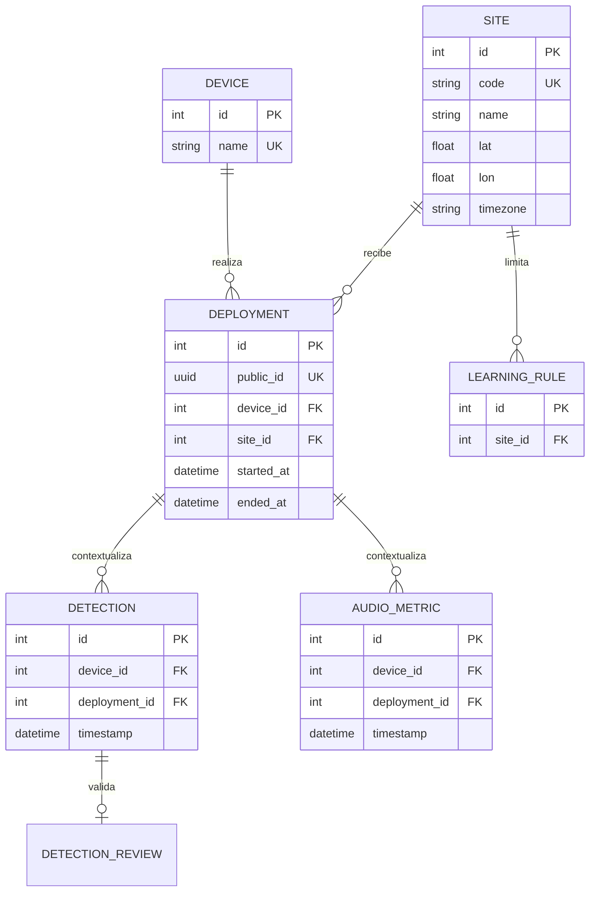

# Fase 1 — diseño de sitios y despliegues

Fecha: 9 de agosto de 2026  
Estado: completada; diseño aprobado para su implementación en la Fase 2  
Alcance: modelo de dominio, identidad, reglas temporales, compatibilidad, medios acústicos y contratos previstos.

## 1. Objetivo

Permitir que un mismo nodo físico, actualmente llamado `birdmonitor`, pueda instalarse sucesivamente en Sevilla, Algeciras, Sangüesa u otros lugares sin sobrescribir el origen geográfico de las observaciones anteriores.

El sistema conservará una única base de datos física. El usuario verá cada ubicación como un conjunto independiente y podrá consultar sus datos históricos aunque la Raspberry Pi ya no esté allí o se encuentre desconectada.

## 2. Diagnóstico del modelo actual

El código actual contiene una sola entidad geográfica: `Device`. Sus campos `location`, `lat` y `lon` se actualizan cada vez que el nodo se registra. Esto provoca cuatro limitaciones:

1. cambiar la ubicación del dispositivo sobrescribe la anterior;
2. las detecciones y métricas solo apuntan al dispositivo, no al lugar ni al periodo de instalación;
3. los eventos de la cola offline no incorporan una instantánea de su ubicación y podrían sincronizarse posteriormente bajo el lugar equivocado;
4. las reglas aprendidas se vinculan al dispositivo, por lo que una regla ecológica local podría viajar con el hardware a otra zona.

También se ha observado que los WAV y espectrogramas se guardan en carpetas planas. Aunque el nombre contiene la fecha, dos nodos o despliegues podrían producir una colisión de nombres.

## 3. Decisión de arquitectura

Se separan tres conceptos:



### 3.1 Device: identidad del hardware

`Device` seguirá representando el equipo físico. Su nombre estable será `birdmonitor`; trasladarlo no creará un dispositivo nuevo.

Los campos geográficos actuales se mantendrán temporalmente por compatibilidad, pero dejarán de ser la fuente histórica de verdad. Durante la transición reflejarán, como máximo, el sitio activo.

### 3.2 Site: lugar geográfico reutilizable

`Site` representa un lugar estable y reutilizable. Volver a Sevilla no crea otra Sevilla: se recupera el mismo sitio y el dashboard agrega por defecto todos sus periodos de observación.

Campos previstos:

| Campo | Regla |
|---|---|
| `id` | Identificador interno entero. |
| `code` | Código público, único e inmutable; minúsculas, números y guiones, por ejemplo `sevilla` o `algeciras`. |
| `name` | Nombre visible, editable, por ejemplo `Sevilla — ubicación principal`. |
| `municipality` | Municipio opcional. |
| `region` | Provincia o región opcional. |
| `country_code` | Código ISO 3166-1 alfa-2; inicialmente `ES`. |
| `lat`, `lon` | Coordenadas opcionales, siempre proporcionadas como pareja y validadas por rango. |
| `location_source` | `manual`, `gps`, `ip_geolocation` o `unknown`. |
| `location_accuracy_m` | Precisión estimada, si se conoce. |
| `timezone` | Zona IANA; inicialmente `Europe/Madrid`. |
| `created_at`, `updated_at` | Auditoría temporal en UTC. |
| `archived_at` | Oculta un sitio sin borrar sus datos históricos. |

El código del sitio no es una contraseña ni concede acceso. Las coordenadas se consideran datos sensibles de la instalación y solo se exponen a usuarios autenticados.

### 3.3 Deployment: periodo de instalación

`Deployment` representa una estancia concreta de un nodo en un sitio. Si el nodo vuelve meses después a Sevilla, utiliza el mismo `Site`, pero abre un `Deployment` nuevo. Esto permite distinguir campañas sin impedir que el usuario consulte el histórico agregado de Sevilla.

Campos previstos:

| Campo | Regla |
|---|---|
| `id` | Identificador interno entero. |
| `public_id` | UUID generado al configurar la instalación; único, estable e idempotente. |
| `device_id` | Dispositivo físico que realiza la campaña. |
| `site_id` | Sitio en el que está instalado. |
| `started_at` | Inicio declarado en UTC. |
| `ended_at` | Fin en UTC; `NULL` indica despliegue activo. |
| `created_at`, `updated_at` | Auditoría del registro. |
| `notes` | Nota operativa opcional, sin secretos. |

Reglas:

- un dispositivo no puede tener dos despliegues activos a la vez;
- activar otro despliegue cierra atómicamente el anterior;
- reutilizar el mismo `public_id` devuelve el mismo despliegue y no lo duplica;
- los despliegues con datos no se eliminan: se cierran o archivan;
- `started_at` debe ser anterior a `ended_at`;
- una detección o métrica debe pertenecer al mismo dispositivo que su despliegue.

La restricción de un único despliegue activo se aplicará tanto en el servicio como mediante un índice único parcial de SQLite sobre `device_id` cuando `ended_at IS NULL`.

## 4. Asociación de datos científicos

### 4.1 Detecciones y métricas

`Detection` y `AudioMetric` incorporarán `deployment_id`. Se conservará inicialmente `device_id` para mantener compatibilidad con consultas, exportaciones y clientes actuales.

La idempotencia se redefinirá por despliegue:

- detección: `deployment_id + timestamp + species + filename`;
- métrica: `deployment_id + timestamp + filename`.

Así, dos campañas no se fusionan aunque generen nombres o marcas temporales coincidentes.

### 4.2 Revisión y aprendizaje local

`DetectionReview` ya queda contextualizada mediante su detección y no necesita duplicar el sitio.

`LearningRule` pasará a estar limitada por `site_id`. Es una decisión necesaria para las especies introducidas o invasoras: una aceptación aprendida en Sevilla podrá reutilizarse al regresar a Sevilla, pero no se aplicará automáticamente en Algeciras o Sangüesa.

Los ejemplos de aprendizaje conservarán su detección de origen. Las 27 reglas existentes se migrarán al sitio histórico de Sevilla.

## 5. Identidad enviada por la Raspberry Pi

La dirección IP, la IP de Tailscale y la ubicación estimada por IP no identificarán un sitio. Pueden cambiar o ser imprecisas. BirdWeather tampoco será la fuente de identidad del proyecto.

La configuración local prevista será:

```dotenv
BIRDMONITOR_NODE_NAME=birdmonitor
BIRDMONITOR_SITE_CODE=algeciras
BIRDMONITOR_DEPLOYMENT_ID=<uuid-del-despliegue>
BIRDMONITOR_NODE_LOCATION=Algeciras, Cádiz, España
BIRDMONITOR_NODE_LAT=<latitud>
BIRDMONITOR_NODE_LON=<longitud>
```

El UUID no es un secreto; permite reintentar el alta sin duplicarla. El token Bearer del nodo seguirá siendo la credencial secreta y no se guardará en la base de datos científica ni en los informes.

Al configurar un cambio de ubicación se generará un UUID nuevo. Reiniciar el servicio sin cambiar la ubicación conservará el UUID actual y, por tanto, el mismo despliegue.

## 6. Cola offline y orden de sincronización

Cada evento de la Raspberry guardará desde el momento de su creación:

- `device_name`;
- `site_code`;
- `deployment_id` público;
- datos científicos del evento.

Estos valores serán una instantánea y no se recalcularán durante el reenvío. Por ello, un evento registrado offline en Sevilla seguirá perteneciendo a Sevilla aunque se sincronice cuando el nodo ya esté configurado en Algeciras.

La cola admitirá un evento idempotente `deployment_start`, enviado antes de detecciones, métricas y archivos del mismo despliegue. Si no existe conectividad, el nodo puede seguir grabando; al recuperarla sincroniza en este orden:

1. alta o reutilización del sitio;
2. activación idempotente del despliegue;
3. métricas y detecciones;
4. WAV y espectrogramas pendientes.

Antes de cambiar la Raspberry a Algeciras, los eventos legacy que ya existan en `offline_outbox.db` deberán etiquetarse explícitamente con el despliegue histórico de Sevilla. Nunca se les asignará el sitio activo en el momento del reenvío.

## 7. Archivos acústicos

Los nuevos archivos se almacenarán bajo una ruta calculada por el servidor, no proporcionada libremente por el cliente:

```text
records/<site-code>/<deployment-uuid>/<filename>.wav
spectrograms/<site-code>/<deployment-uuid>/<filename>.png
```

El nombre será saneado como en la implementación actual y el servidor resolverá el directorio a partir del despliegue autenticado. Esto evita traversal de rutas y colisiones entre campañas.

Los 185 WAV y 185 espectrogramas existentes permanecerán en la disposición plana original. El despliegue migrado de Sevilla utilizará un modo de resolución compatible: primero buscará la ruta segmentada y, para los registros históricos, la ruta plana. No se moverán archivos durante la migración de esquema.

El dashboard y los informes dejarán de construir enlaces directos a partir de un nombre. Solicitarán el medio mediante el identificador de la detección o del despliegue, conservando las protecciones de sesión existentes.

## 8. Contrato de API previsto

### Administración desde el dashboard

- `GET /sites/`: lista de sitios, totales e indicación del sitio activo.
- `POST /sites/`: creación validada de un sitio.
- `PATCH /sites/{site_id}`: edición o archivado, con sesión y CSRF.
- `GET /sites/{site_id}/deployments`: campañas del sitio.
- `GET /devices/{device_id}/deployments`: historial del nodo.

### Comunicación del nodo

- `POST /node/deployments/activate`: registra de forma idempotente el sitio y despliegue configurados.
- `POST /detections/`: añadirá `site_code` y `deployment_id` público.
- `POST /audio-metrics/`: añadirá los mismos campos.
- `POST /upload/`: añadirá el identificador de despliegue como campo multipart y guardará el archivo bajo la ruta derivada.

Las rutas de nodo exigirán Bearer. Las rutas que modifican configuración desde el navegador exigirán sesión y protección CSRF. El backend comprobará que el despliegue pertenece al dispositivo indicado y rechazará asociaciones contradictorias.

### Consulta

Detecciones, métricas, analítica y exportaciones aceptarán:

- `site_id` como filtro principal para el usuario;
- `deployment_id` como filtro opcional de campaña;
- `device_id` por compatibilidad y diagnóstico;
- intervalo temporal en UTC.

Las respuestas incluirán `site_id`, `site_code`, `site_name`, `deployment_id` interno y `deployment_public_id` cuando resulte necesario para la interfaz.

## 9. Comportamiento del dashboard

La pestaña de nodos mostrará primero el hardware y su situación operativa. Desde cada nodo se podrá abrir su historial de sitios.

El selector geográfico funcionará así:

- `Sevilla`: todas las observaciones de todos sus despliegues;
- `Algeciras`: solo observaciones asociadas a Algeciras;
- selector secundario opcional: una campaña concreta;
- ubicación sin nodo conectado: datos históricos disponibles, estado `sin conexión`;
- sitio activo: distintivo independiente del estado de conectividad.

No se volverá a mostrar siempre `ONLINE`: el estado se calculará con la última comunicación del nodo o del streaming.

## 10. Fechas, ubicación y BirdNET/BirdWeather

- La base almacenará fechas en UTC.
- El dashboard mostrará fechas en la zona IANA del sitio.
- BirdNET recibirá las coordenadas del sitio activo para sus filtros geográficos.
- BirdWeather recibirá las coordenadas capturadas en la instantánea del despliegue correspondiente.
- La geolocalización por IP solo podrá proponerse como ayuda inicial; nunca cambiará automáticamente un sitio ya confirmado.

## 11. Migración histórica acordada

La Fase 2 deberá:

1. crear `sites`, `deployments` y el registro de versiones de migración;
2. crear o reutilizar el sitio `sevilla` con las coordenadas actuales del dispositivo;
3. crear un despliegue histórico de `birdmonitor` en Sevilla;
4. asignar a ese despliegue las 198 detecciones y 1 168 métricas existentes;
5. asociar a Sevilla las 27 reglas de aprendizaje actuales;
6. conservar identificadores, revisiones, ejemplos, nombres de archivo y fechas;
7. validar que no queda ninguna fila histórica sin contexto;
8. verificar que los hashes lógicos de los campos originales siguen coincidiendo con la Fase 0.

Durante el despliegue escalonado, el backend aceptará temporalmente payloads antiguos y los enviará al despliegue legacy de Sevilla con una advertencia explícita en el log. Esta compatibilidad solo se utilizará mientras la Raspberry permanezca apagada o hasta instalar su nuevo código; no debe utilizarse para empezar a capturar en Algeciras.

## 12. Privacidad y seguridad

- No se crea una base de datos distinta por ubicación ni se expone SQLite por red.
- Los códigos de sitio no contienen direcciones completas ni secretos.
- Las coordenadas y medios solo se entregan tras autenticación.
- Los sitios con histórico se archivan, no se borran desde la interfaz ordinaria.
- Todas las entradas se validan; el cliente no decide rutas del sistema de archivos.
- El token del nodo autentica; `deployment_id` aporta identidad e idempotencia, no autorización.
- Un cambio de sitio queda registrado mediante inicio y fin de despliegue.
- Las consultas y exportaciones filtran en el servidor, no únicamente en JavaScript.

## 13. Decisiones descartadas

### Una base de datos por ubicación

Complicaría autenticación, actualizaciones, copias, consultas conjuntas y recuperación. No aporta aislamiento real en una instalación de un único propietario.

### Sobrescribir `Device.location`

Es el comportamiento actual y pierde procedencia histórica.

### Deducir el sitio por IP

La IP pública, local o de Tailscale no representa de forma fiable la posición física.

### Reutilizar siempre el mismo despliegue al volver a una zona

Impediría diferenciar campañas y calcular periodos de observación. Se reutiliza el sitio, no el periodo de instalación.

## 14. Criterios de aceptación para las siguientes fases

- Ningún dato de Sevilla cambia a Algeciras al modificar la configuración del nodo.
- Una detección offline conserva el sitio en el que se produjo.
- Volver a Sevilla crea otra campaña, pero el selector Sevilla muestra ambas.
- Los resultados históricos se consultan con la Raspberry desconectada.
- Dos campañas pueden contener el mismo nombre de archivo sin sobrescribirse.
- Las reglas aprendidas no se aplican fuera de su sitio.
- El cambio de ubicación es idempotente y recuperable tras un corte de red.
- Ninguna API permite asociar un evento a un despliegue de otro dispositivo.
- La migración conserva 198 detecciones, 1 168 métricas, 174 revisiones, 163 ejemplos y 27 reglas.
- El sistema mantiene el funcionamiento actual durante el despliegue escalonado.

## 15. Resultado de la fase

El modelo queda definido para implementarse sin conectar todavía la Raspberry Pi. La próxima fase modificará el esquema y ejecutará la migración sobre bases de prueba y copias temporales antes de autorizar cualquier cambio sobre la base operativa.
